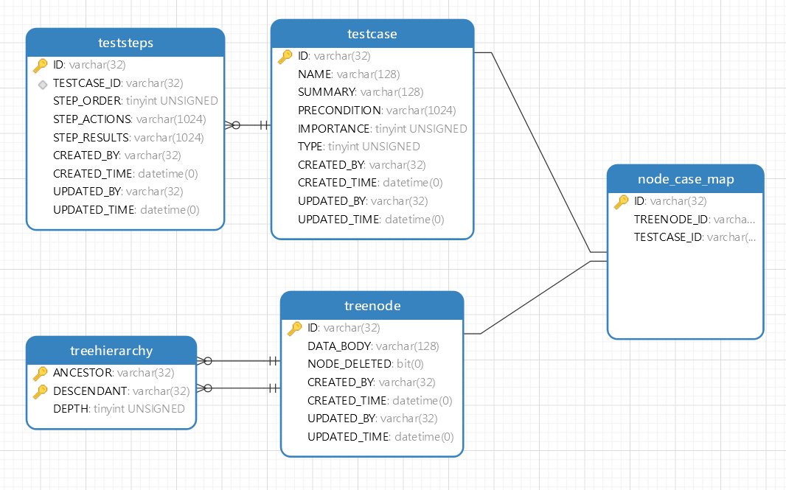

### 数据库设计文档

#### [设计UML图](./db.png) 




#### [SQL脚本](./TCMer.sql)

```mysql
CREATE TABLE `testcase` (
`ID` varchar(32) CHARACTER SET utf8 COLLATE utf8_general_ci NOT NULL COMMENT 'ID',
`NAME` varchar(128) CHARACTER SET utf8 COLLATE utf8_general_ci NOT NULL COMMENT '用例名称',
`SUMMARY` varchar(128) CHARACTER SET utf8 COLLATE utf8_general_ci NULL DEFAULT NULL COMMENT '用例摘要',
`PRECONDITION` varchar(1024) CHARACTER SET utf8 COLLATE utf8_general_ci NULL DEFAULT NULL COMMENT '用例前提',
`IMPORTANCE` tinyint(1) UNSIGNED NULL DEFAULT NULL COMMENT '重要性 2:高,1:中,0:低',
`TYPE` tinyint(1) UNSIGNED NULL DEFAULT NULL COMMENT '用例类型 0:手工,1:自动,2:性能',
`CREATED_BY` varchar(32) CHARACTER SET utf8 COLLATE utf8_general_ci NULL DEFAULT NULL COMMENT '创建人',
`CREATED_TIME` datetime NULL DEFAULT NULL COMMENT '创建时间',
`UPDATED_BY` varchar(32) CHARACTER SET utf8 COLLATE utf8_general_ci NULL DEFAULT NULL COMMENT '更新人',
`UPDATED_TIME` datetime NULL DEFAULT NULL COMMENT '更新时间',
PRIMARY KEY (`ID`) 
)
ENGINE = InnoDB
DEFAULT CHARACTER SET = utf8
COLLATE = utf8_general_ci
COMMENT = '测试用例 '
ROW_FORMAT = Dynamic;

CREATE TABLE `teststeps` (
`ID` varchar(32) CHARACTER SET utf8 COLLATE utf8_general_ci NOT NULL COMMENT 'ID',
`TESTCASE_ID` varchar(32) CHARACTER SET utf8 COLLATE utf8_general_ci NOT NULL COMMENT '关联测试用例',
`STEP_ORDER` tinyint(2) UNSIGNED NULL DEFAULT NULL COMMENT '步骤顺序',
`STEP_ACTIONS` varchar(1024) CHARACTER SET utf8 COLLATE utf8_general_ci NULL DEFAULT NULL COMMENT '步骤动作',
`STEP_RESULTS` varchar(1024) CHARACTER SET utf8 COLLATE utf8_general_ci NULL DEFAULT NULL COMMENT '步骤结果',
`CREATED_BY` varchar(32) CHARACTER SET utf8 COLLATE utf8_general_ci NULL DEFAULT NULL COMMENT '创建人',
`CREATED_TIME` datetime NULL DEFAULT NULL COMMENT '创建时间',
`UPDATED_BY` varchar(32) CHARACTER SET utf8 COLLATE utf8_general_ci NULL DEFAULT NULL COMMENT '更新人',
`UPDATED_TIME` datetime NULL DEFAULT NULL COMMENT '更新时间',
PRIMARY KEY (`ID`) ,
INDEX `teststeps_ibfk_1` (`TESTCASE_ID` ASC) USING BTREE
)
ENGINE = InnoDB
DEFAULT CHARACTER SET = utf8
COLLATE = utf8_general_ci
COMMENT = '测试步骤'
ROW_FORMAT = Dynamic;

CREATE TABLE `treehierarchy` (
`ANCESTOR` varchar(32) CHARACTER SET utf8 COLLATE utf8_general_ci NOT NULL COMMENT '祖先',
`DESCENDANT` varchar(32) CHARACTER SET utf8 COLLATE utf8_general_ci NOT NULL COMMENT '后裔',
PRIMARY KEY (`ANCESTOR`, `DESCENDANT`) ,
INDEX `DESCENDANT` (`DESCENDANT` ASC) USING BTREE
)
ENGINE = InnoDB
DEFAULT CHARACTER SET = utf8
COLLATE = utf8_general_ci
COMMENT = '树层级 '
ROW_FORMAT = Dynamic;

CREATE TABLE `treenode` (
`ID` varchar(32) CHARACTER SET utf8 COLLATE utf8_general_ci NOT NULL COMMENT 'ID',
`DATA_BODY` varchar(128) CHARACTER SET utf8 COLLATE utf8_general_ci NULL DEFAULT NULL COMMENT '节点名称',
`NODE_DELETED` datetime NULL DEFAULT NULL COMMENT '节点删除',
`CREATED_BY` varchar(32) CHARACTER SET utf8 COLLATE utf8_general_ci NULL DEFAULT NULL COMMENT '创建人',
`CREATED_TIME` datetime NULL DEFAULT NULL COMMENT '创建时间',
`UPDATED_BY` varchar(32) CHARACTER SET utf8 COLLATE utf8_general_ci NULL DEFAULT NULL COMMENT '更新人',
`UPDATED_TIME` datetime NULL DEFAULT NULL COMMENT '更新时间',
PRIMARY KEY (`ID`) 
)
ENGINE = InnoDB
DEFAULT CHARACTER SET = utf8
COLLATE = utf8_general_ci
COMMENT = '树节点 '
ROW_FORMAT = Dynamic;

ALTER TABLE `teststeps` ADD CONSTRAINT `teststeps_ibfk_1` FOREIGN KEY (`TESTCASE_ID`) REFERENCES `testcase` (`ID`) ON DELETE RESTRICT ON UPDATE RESTRICT;
ALTER TABLE `treehierarchy` ADD CONSTRAINT `treehierarchy_ibfk_1` FOREIGN KEY (`ANCESTOR`) REFERENCES `treenode` (`ID`) ON DELETE RESTRICT ON UPDATE RESTRICT;
ALTER TABLE `treehierarchy` ADD CONSTRAINT `treehierarchy_ibfk_2` FOREIGN KEY (`DESCENDANT`) REFERENCES `treenode` (`ID`) ON DELETE RESTRICT ON UPDATE RESTRICT;
```


# 摘要

[1] [树结构设计参考](https://gist.github.com/ekillaby/2377806) <https://gist.github.com/ekillaby/2377806>